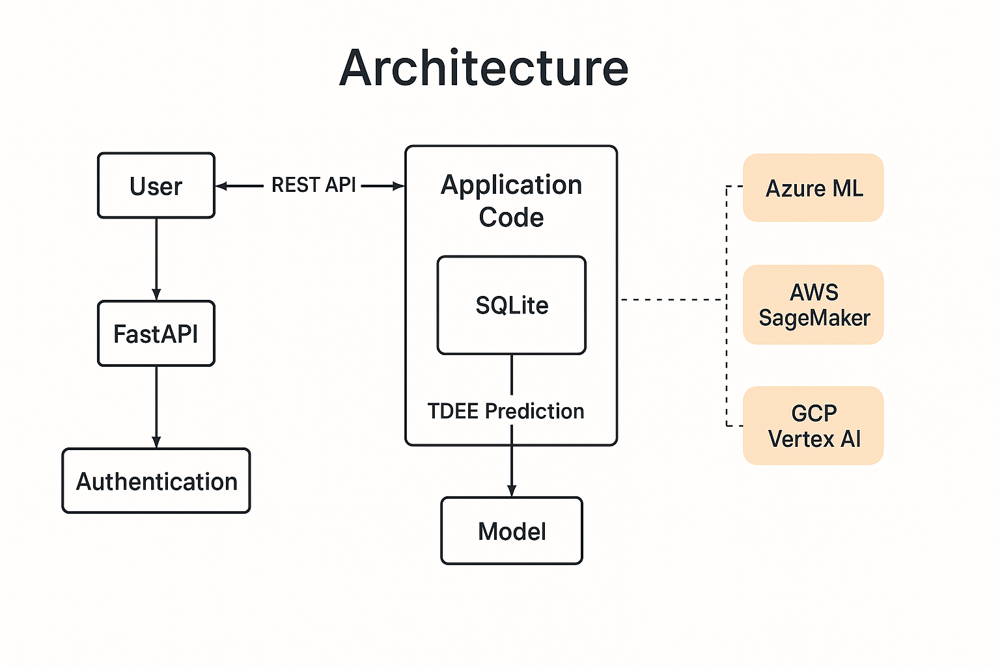

# metabolicai


---

**metabolicai** is a production-ready, cloud-deployable API for tracking and predicting your Total Daily Energy Expenditure (TDEE) using your real-world weight, calorie data, age, and gender.

Built to showcase modern **AI engineering** and **MLOps** skills—leveraging **FastAPI**, **scikit-learn**, **Docker**, and **CI/CD**—with secure, multi-user support, profile-aware predictions, and one-command local or cloud deployment.

---

## 🚦 Getting Started

### Option 1: Run Locally (No Docker)

```bash
git clone https://github.com/furqanagwan/metabolicai.git
cd metabolicai
cp .env.example .env
python3 -m venv venv
source venv/bin/activate
pip install -r requirements.txt
uvicorn app.main:app --reload
```

* The API will be live at: [http://localhost:8000](http://localhost:8000)
* Interactive API docs: [http://localhost:8000/docs](http://localhost:8000/docs)

### Option 2: Run with Docker

```bash
git clone https://github.com/furqanagwan/metabolicai.git
cd metabolicai
cp .env.example .env
docker-compose up --build
```

* The API and docs will also be at [http://localhost:8000](http://localhost:8000)

---

## 1️⃣ Register a User Profile

You must create a user profile (with age & gender) before logging entries:

```bash
curl -X POST "http://localhost:8000/user" \
  -H "X-API-Key: yourapikey" \
  -H "Content-Type: application/json" \
  -d '{"user_id": "demo", "age": 30, "gender": "male"}'
```

## 2️⃣ Log or Update Entries

* **Add weight and calories together:**

```bash
curl -X POST "http://localhost:8000/entry" \
  -H "X-API-Key: yourapikey" \
  -H "X-User-Id: demo" \
  -H "Content-Type: application/json" \
  -d '{"date": "2025-07-13", "weight": 75, "calories": 2200}'
```

* **Add or update just weight or calories (PATCH):**

```bash
curl -X PATCH "http://localhost:8000/entry" \
  -H "X-API-Key: yourapikey" \
  -H "X-User-Id: demo" \
  -H "Content-Type: application/json" \
  -d '{"date": "2025-07-13", "weight": 76}'
```

* **Predict TDEE:**

```bash
curl -H "X-API-Key: yourapikey" -H "X-User-Id: demo" http://localhost:8000/tdee
```

---

## 🚀 Features

* **User Profiles** – Register with age and gender for more personalized and accurate TDEE predictions
* **REST API** – Secure, multi-user endpoints for profile, data logging, TDEE prediction, and entry history
* **Smart Upserts** – Log weight and/or calories for any date, in any order—entries are merged and retrained automatically
* **Auto Model Training** – ML model uses your historical data, age, and gender (with retraining on new/updated entries)
* **Persistence** – User data and models stored via SQLite and versioned pickle files
* **Cloud/Container Ready** – One-command deploys with Docker & docker-compose; cloud deploy guides for Azure ML, SageMaker, and GCP Vertex AI
* **CI/CD** – Automated testing and linting with GitHub Actions
* **Professional Docs & Diagram** – Clean, portfolio-focused documentation and architecture visuals

---

## 🏗️ Architecture

* **FastAPI** for robust API and interactive docs
* **scikit-learn** for ML model training and prediction (using age/gender as features)
* **SQLite** for reliable, easy-to-use data storage
* **Joblib** for model versioning
* **Docker** & **docker-compose** for seamless, cross-platform deploys
* **API Key Authentication** for secure multi-user access
* **CI/CD** with GitHub Actions
* **Cloud Ready** – deployment guides for Azure, AWS, and GCP (`DEPLOY.md`)



---

## 📦 Repo Structure

```
metabolicai/
│
├── app/
│   ├── __init__.py        # Python package marker
│   ├── main.py            # FastAPI entrypoint, routes, lifespan
│   ├── auth.py            # API key authentication logic
│   ├── database.py        # SQLite database helpers (init, CRUD, user profile)
│   ├── model.py           # ML model training, prediction, persistence
│   └── schemas.py         # Pydantic data models (Entry, UserProfile, TDEE)
│
├── data/                  # Persistent SQLite DB (created at runtime)
│   └── entries.db
│
├── models/                # Trained ML models per user (created at runtime)
│
├── tests/
│   └── test_api.py        # Automated API & model tests
│
├── .github/
│   └── workflows/
│       └── ci.yml         # GitHub Actions workflow for CI/CD
│
├── .env.example           # Example environment variables
├── requirements.txt       # Python dependencies
├── Dockerfile             # Docker image build recipe
├── docker-compose.yml     # One-command service orchestration
├── arch-diagram.png       # Project architecture diagram
├── README.md              # This documentation
└── DEPLOY.md              # (Optional) Cloud deployment guides
```

* `app/` – All backend Python code, organized by purpose
* `data/`, `models/` – Runtime storage for user data and ML models (auto-created at runtime)
* `tests/` – All automated test code
* `.github/workflows/` – CI/CD pipeline for code quality
* Docker, docs, and config for instant setup and onboarding

---

## 🔌 API Usage

* **User Profile:**
  Register or update with `/user` endpoint, providing `user_id`, `age`, and `gender`.
* **Add/Update Entry:**
  POST `/entry` (weight/calories together) or PATCH `/entry` (just one field, any time).
* **Predict TDEE:**
  GET `/tdee` returns personalized prediction (needs 3+ complete entries).
* **Entry History:**
  GET `/history` for all your entries (date, weight, calories).
* **Security:**
  All endpoints require `X-API-Key`, and user endpoints require `X-User-Id`.

---

## 🙋‍♂️ Contributing

Contributions are very welcome!

* **Open a Pull Request (PR):**
  Add new features, bug fixes, or improvements. PRs are reviewed for code style and usefulness.
* **Describe your changes:**
  Include a clear description, and add/modify tests where appropriate.
* **Open Issues:**
  Use GitHub Issues for questions, proposals, or to discuss larger changes before coding.
* **Be kind and constructive:**
  Friendly collaboration keeps this project growing!

All contributors will be credited in the repo. Let’s build something amazing together!

---

## ❓ FAQ

**Do I need to create the `data/` or `models/` folders?**
Nope! The code will auto-create these folders as soon as you use the API. You can delete them anytime to start fresh.

**How do I reset all data and models?**
Just delete the `data/` and `models/` folders (or the files inside them). They'll be recreated next time you run the app.

**Can I use a different database?**
Yes! But you'll need to update `app/database.py` for your chosen DB backend (e.g., PostgreSQL).

**How do I change my API key?**
Edit the `.env` file and restart the app. All future requests must use the new API key.

**Can I use this with multiple users?**
Yes! Each unique `X-User-Id` header acts as a separate user/account. You can build a frontend to manage users if you want.

**Is there a frontend?**
Not yet—this is API-only. You can easily build a web or mobile UI on top!

**Do I need to provide age and gender for every entry?**
No! Just register once via `/user`. Your profile is used for all entries.

---

## 📄 License

MIT

---